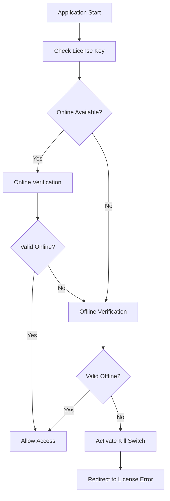

# 🔐 License Configuration Guide
## Trucking Weight Management System

This guide explains how to configure and manage licenses for the Trucking Weight Management System, including both online and offline license verification.

## 📋 Overview

The system supports **hybrid license verification**:
- **Online Verification**: Uses Supabase database for real-time license validation
- **Offline Verification**: Uses local license files for air-gapped environments
- **Automatic Fallback**: Falls back to offline verification if online fails

## 🚀 Quick Start (Offline License)

### For Windows:
```bash
# Run the license configuration tool
setup-license.bat
```

### For Linux/Mac:
```bash
# Make executable and run
chmod +x setup-license.sh
./setup-license.sh
```

### Manual Setup:
```bash
# Run the license tool directly
node license-config-tool.js
```

## 🛠️ License Configuration Tool

The `license-config-tool.js` provides an interactive interface to:

1. **Create New License**: Generate a new offline license
2. **View Current License**: Display current license information
3. **Manage License Settings**: Update license parameters

### Creating a New License:

1. Run the tool: `node license-config-tool.js`
2. Select option `1` (Create New License)
3. Enter the required information:
   - Customer Name
   - Customer Email
   - Company Name
   - License Plan (Basic/Professional/Enterprise)
   - Maximum Users
   - Maximum Tenants
   - License Duration (months)

The tool will:
- Generate a unique license key (format: `CEG-XXXXXXXX-XXXXXXXX`)
- Create `config/license.json` file
- Update `frontend/.env.local` with license key
- Configure offline license verification

## 📁 File Structure

```
project-root/
├── config/
│   └── license.json              # Offline license file
├── frontend/
│   ├── .env.local               # Environment variables (license key)
│   └── src/
│       ├── utils/
│       │   ├── license.js       # License verification logic
│       │   └── license-verification.js
│       └── app/api/license/
│           ├── verify/route.ts  # Online verification API
│           └── offline/route.ts # Offline verification API
├── license-config-tool.js       # License configuration tool
├── setup-license.bat           # Windows setup script
└── setup-license.sh            # Linux/Mac setup script
```

## 🔧 Configuration Files

### 1. License File (`config/license.json`)
```json
{
  "licenseKey": "CEG-XXXXXXXX-XXXXXXXX",
  "customer": {
    "name": "Customer Name",
    "email": "customer@example.com",
    "company": "Company Name"
  },
  "plan": "enterprise",
  "features": ["basic", "advanced", "api", "premium"],
  "maxUsers": 50,
  "maxTenants": 5,
  "expiresAt": "2026-05-17T03:42:28.100-05:00",
  "status": "active",
  "domains": ["localhost", "127.0.0.1", "yourdomain.com"],
  "createdAt": "2025-01-16T12:00:00.000Z"
}
```

### 2. Environment Variables (`.env.local`)
```env
# License Configuration
NEXT_PUBLIC_LICENSE_KEY=CEG-XXXXXXXX-XXXXXXXX
NEXT_PUBLIC_SECURITY_TOKEN=your-security-token-here
```

## 📊 License Plans & Features

| Plan | Features | Max Users | Max Tenants | API Access |
|------|----------|-----------|-------------|-------------|
| **Basic** | Basic functionality | 5 | 1 | ❌ |
| **Professional** | Basic + Advanced | 25 | 3 | ❌ |
| **Enterprise** | All features | 50+ | 5+ | ✅ |

### Available Features:
- `basic`: Core weight management functionality
- `advanced`: Advanced reporting and analytics
- `api`: REST API access for integrations
- `premium`: Premium support and features

## 🔄 License Verification Flow



## 🚨 License Validation

The system validates:
- **License Key Format**: Must match `CEG-XXXXXXXX-XXXXXXXX`
- **Expiration Date**: License must not be expired
- **Domain Authorization**: Domain must be in allowed domains list
- **Status**: License status must be 'active'
- **Feature Access**: Features must be included in license plan

## 🛡️ Security Features

- **Kill Switch**: Automatically disables application for invalid licenses
- **Domain Validation**: Restricts usage to authorized domains
- **Instance Tracking**: Prevents unauthorized multiple installations
- **Tamper Detection**: Monitors for application modifications
- **Encrypted Storage**: Sensitive data is encrypted in local storage

## 🔧 Troubleshooting

### License Not Found
```bash
# Check if license file exists
ls -la config/license.json

# Check environment variables
cat frontend/.env.local | grep LICENSE
```

### License Expired
1. Run license tool: `node license-config-tool.js`
2. Create new license with extended expiration
3. Restart application

### Domain Not Authorized
1. Edit `config/license.json`
2. Add your domain to the `domains` array
3. Restart application

### Online Verification Failing
- The system automatically falls back to offline verification
- Check console for "🔒 Using offline license verification" message
- Ensure `config/license.json` exists and is valid

## 🔄 Updating Licenses

### Method 1: Using the Configuration Tool
```bash
node license-config-tool.js
# Select option 1 to create new license
```

### Method 2: Manual File Edit
1. Edit `config/license.json`
2. Update expiration date, features, or other parameters
3. Restart application

### Method 3: API Update
```bash
curl -X POST http://localhost:3000/api/license/offline \
  -H "Content-Type: application/json" \
  -d '{
    "licenseKey": "CEG-XXXXXXXX-XXXXXXXX",
    "customer": {...},
    "plan": "enterprise",
    "expiresAt": "2026-12-31T23:59:59.999Z"
  }'
```

## 📞 Support

For license-related issues:
- Check the console for detailed error messages
- Review the license file format and validity
- Ensure all required environment variables are set
- Contact support with license key and error details

## 🔒 License Key Format

License keys follow this format:
- **CEG**: Company prefix (Cosmo Exploit Group)
- **XXXXXXXX**: 8-character unique identifier
- **XXXXXXXX**: 8-character validation code

Example: `CEG-7NANHMX_G71E-XYGNCLZY`

---

**© 2025 Cosmo Exploit Group LLC. All Rights Reserved.**
