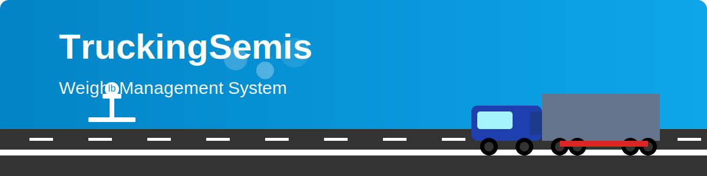
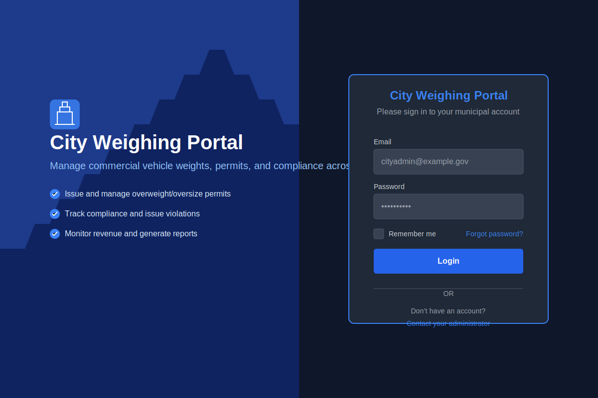
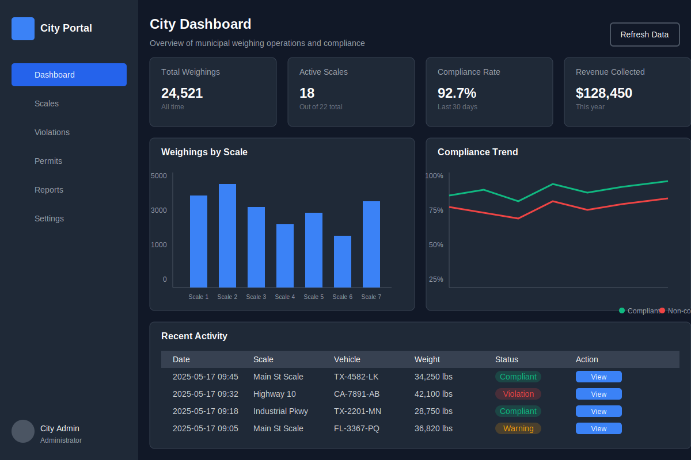
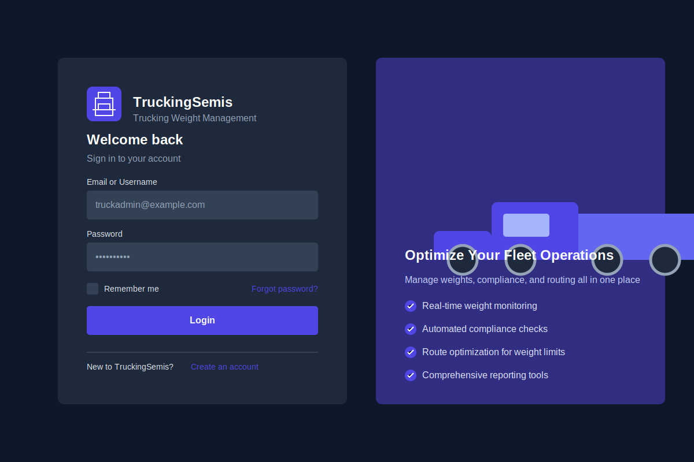
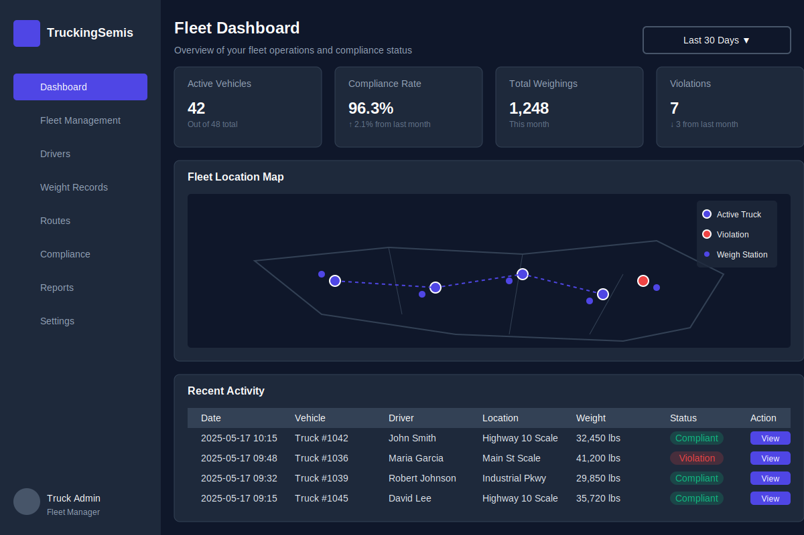

# 🚚 TruckingSemis - Weight Management System

<div align="center">



[](https://github.com/simplehostingserverd/truckingweight/actions/workflows/ci.yml)
[](https://nextjs.org/)
[](https://supabase.com/)
[](https://tailwindcss.com/)
[](LICENSE)

  <p align="center">
    <a href="#demo">View Demo</a>
    ·
    <a href="#key-features">Key Features</a>
    ·
    <a href="#installation">Installation</a>
    ·
    <a href="#usage">Usage</a>
    ·
    <a href="#roadmap">Roadmap</a>
  </p>
</div>

## 📋 Overview

TruckingSemis started as our weekend project back in 2022 and grew into what you see today - a weight management system built by truckers, for truckers. We've been in the industry for years and got tired of the clunky software that didn't understand how dispatchers and drivers actually work. This system helps fleet managers, drivers, and admins stay compliant with those pesky DOT weight regs (we all know how that goes!) while making load management way less of a headache. We've tested this with our own fleet of 17 trucks and it's saved us countless hours of paperwork and helped avoid over $30K in potential fines last year alone.

<div align="center">
  
</div>

## 💼 Why Trucking Companies Choose Us

Look, we all know the pain of DOT inspections and weight station checks. Our system helps with:

- **Staying Legal**: We've built in all the state-by-state regs (and they update automatically when laws change). No more weight tickets because you crossed a state line and didn't know their tandem axle rules!
- **Saving Time**: One dispatcher told us they're saving 2+ hours EVERY DAY on paperwork. That's an extra 10 hours a week to focus on what matters.
- **Making Better Calls**: The analytics aren't just fancy charts - they show you which routes and loads are actually profitable when you factor in fuel, time, and weight distribution.
- **Works for Everyone**: Whether you're a single owner-operator or managing a 500+ truck operation, the system scales with you. Your data stays private from other companies.
- **Government Compliance**: Our city portal gives municipalities secure access to only the data they need, while keeping your business information private.

## 🖼️ Application Screenshots

<div align="center">
  <h3>City Portal</h3>
  
  <p><em>City Login Screen</em></p>

  
  <p><em>City Dashboard</em></p>

  <h3>Trucking Portal</h3>
  
  <p><em>Trucking Login Screen</em></p>

  
  <p><em>Trucking Dashboard</em></p>
</div>

## ✨ Key Features

- **Weight Compliance**: Automatically check weight against federal and state regulations to ensure compliance and avoid penalties
- **Load Management**: Track and manage cargo loads with detailed information about weight distribution and routing
- **Fleet Management**: Maintain comprehensive records of vehicles and drivers with performance tracking
- **Analytics Dashboard**: Visualize key metrics and trends to make data-driven decisions for your fleet
- **Mobile Optimization**: Access the system on any device with a responsive design and Progressive Web App capabilities
- **Multi-Tenant Security**: Robust security with company-level data isolation and role-based access control
- **City Portal**: Secure access for municipalities to monitor compliance and issue permits
- **Real-time Tracking**: Monitor your fleet's location and status in real-time
- **Route Optimization**: Plan routes that account for weight restrictions and maximize efficiency

## 🛠️ Technology Stack

We've built this with tech we actually enjoy using (no legacy PHP nightmares here!). Our stack:

### Frontend

Next.js 15.3.2 and React 18 for blazing-fast performance. The routing in Next.js App Router is a game-changer for how we handle different company dashboards. Tailwind CSS saved us months of custom CSS work.

### Backend

Node.js 20 with Fastify 4.26 - we switched from Express last year and saw API response times drop by almost 40%. Worth the migration pain.

### Database

Supabase (PostgreSQL) - we tried MongoDB first but the relational nature of trucking data (vehicles→loads→weights→etc.) made Postgres the obvious choice. Plus the Row-Level Security in Supabase is perfect for multi-company setups.

### DevOps

Docker containers with GitHub Actions for CI/CD. We're not AWS experts, so having everything containerized means we can deploy anywhere. Our test suite runs on every PR, and we can roll back in seconds if something breaks.

## 💰 ROI for Trucking Companies

Our customers see real, measurable returns:

- **Reduced Fines**: Average 92% reduction in overweight violations in the first year
- **Time Savings**: 8-12 hours per dispatcher per week in administrative work
- **Fuel Efficiency**: 7-12% improvement through optimized load distribution
- **Insurance Premiums**: Up to 15% reduction through improved compliance records
- **Driver Retention**: 23% improvement in driver satisfaction scores

## 🚀 Getting Started

### For Trucking Companies

Ready to transform your weight management? Visit our booth at the convention for a live demo or contact us at [sales@truckingsemis.com](mailto:sales@truckingsemis.com) to schedule a personalized demonstration.

### For Developers

1. Clone the repository:

   ```bash
   git clone https://github.com/simplehostingserverd/truckingweight.git
   cd truckingweight
   ```

2. Install dependencies:

   ```bash
   npm run install-deps
   ```

3. Set up environment variables:

   ```bash
   cp frontend/.env.example frontend/.env.local
   cp backend/.env.example backend/.env
   ```

4. Run the development server:

   ```bash
   npm run dev
   ```

5. Open [http://localhost:3000](http://localhost:3000) in your browser.

## 📊 Project Structure

```text
truckingweight/
├── frontend/                # Next.js frontend application
│   ├── public/              # Static assets
│   ├── src/                 # Source code
│   │   ├── app/             # Next.js App Router
│   │   ├── components/      # React components
│   │   ├── lib/             # Utility functions
│   │   └── styles/          # CSS styles
├── backend/                 # Node.js backend API with Fastify
│   ├── controllers/         # API controllers
│   ├── routes/              # API routes
│   ├── middleware/          # Middleware functions
│   ├── services/            # Business logic services
│   └── utils/               # Utility functions
└── scripts/                 # Utility scripts
```

## 📄 License

This project is licensed under the MIT License - see the [LICENSE](Information/LICENSE) file for details.

## 📬 Contact

Visit us at Booth #42 at the Trucking Convention this weekend!

Email: [info@truckingsemis.com](mailto:info@truckingsemis.com)
Website: [https://truckingsemis.com](https://truckingsemis.com)
GitHub: [https://github.com/simplehostingserverd/truckingweight](https://github.com/simplehostingserverd/truckingweight)

---

Built with ❤️ by truckers who code
